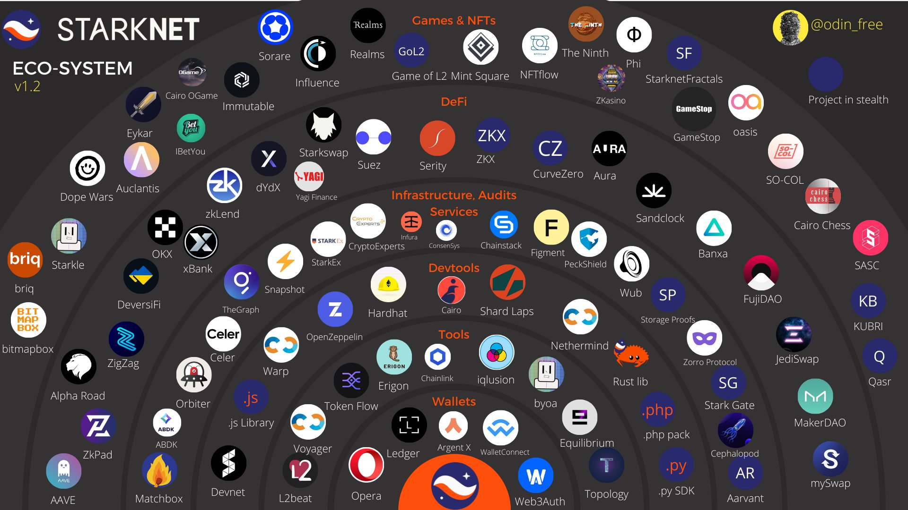

<div align="center">
    
    <h2>Configurando Docker para Starknet<h2>
</div>

## Nadai Configuración Docker para Starknet

Esta repo es una prueba de como configurar Docker y encapsular los proyectos que estemos realizando en contenedores. Este Workshop ha sido realizado siguiendo los pasos oficiales,

- [David Barreto Starware Enviroment With Docker](https://medium.com/starknet-edu/setting-up-a-starknet-dev-environment-with-docker-19955188bb20)
 
Para crear un entorno de desarrollo de StarkNet que encapsule las dependencias globales y del proyecto, deberá tener instalado [Docker Desktop](https://docs.docker.com/get-docker/), [VSCode](https://code.visualstudio.com/download) , la extensión [VSCode Dev Containers](https://marketplace.visualstudio.com/items?itemName=ms-vscode-remote.remote-containers) , un `Dockerfile` y un archivo `.devcontainer.json`, ambos en la raíz de su carpeta de proyecto.

---
**NOTA: Aunque iremos paso a paso, no podremos hacer el tutorial muy extenso, así que las partes de algunas instalaciones básicas sobre Docker, Vscode o ajustes básicos deberá ir revisando cada guía oficial. EL Dockerfile irá cambiando a lo largo del tutorial enseñandose por fotos, puede encontrar el [Dockerfile final](/Dockerfile)**
---

---

## El problema que queremos resolver

Normalmente recomendamos usar un entorno de desarrollo simple para StarkNet utilizando el entorno virtual de Python `(venv)` para encapsular dependencias a nivel de proyecto. Esto garantiza que cuando sus compañeros de equipo clonen su repositorio, todos terminarán con exactamente las mismas dependencias para su proyecto de Cairo y que podrán administrar múltiples proyectos `Cairo u otros` que usan diferentes versiones de los mismos paquetes de Python sin colusión.

Sin embargo, una cosa importante quedó fuera de la encapsulación del proyecto: `El binario de Python` Dependiendo de la versión de Cairo que use su proyecto, es posible que necesite una versión diferente de Python. Cairo puede requerir el uso de `Python 3.9`, ya que el uso de la última versión de `Python 3.10` en realidad suele causar problemas al intentar compilar un contrato inteligente escrito en El Cairo.

Con el entorno de desarrollo simplista mencionado anteriormente, su única opción para `garantizar` que todos los desarrolladores de su equipo usarán la versión correcta de Python para su proyecto Cairo es la documentación. Esto crea un nuevo problema ya que los pasos para instalar una versión particular de Python difieren según su sistema operativo y para algunos de ellos es sorprendentemente desafiante (intente obtener Python 3.9 con la versión correcta de pip en Ubuntu, ugh …).

Sus dependencias globales aumentarán con el tiempo a medida que crezca la complejidad de su proyecto Cairo. NodeJS es otra dependencia global común para un proyecto de Cairo que se requiere si su equipo está creando una aplicación descentralizada con una interfaz de usuario web o una interfaz de usuario móvil utilizando React Native. Mismo problema que con el binario de Python, ¿cómo garantiza que todos sus desarrolladores tengan instalada la misma versión de Node globalmente? ¿Cuánto esfuerzo dedica a documentar la instalación de todos los sistemas operativos que sus compañeros de equipo podrían usar?

Nuestro entorno de desarrollo simple falla al encapsular estas dependencias globales. Afortunadamente, podemos usar Docker para encapsular completamente un sistema operativo, dependencias globales y dependencias de proyectos.

---

## Creación de una imagen Docker para Python

El primer paso que usted y sus compañeros de equipo deberán hacer es instalar y ejecutar Docker Desktop. Para verificar que Docker se está ejecutando correctamente, puede interactuar con su CLI (Ctrl + Alt + t):

```bash
docker --version 
```


Ahora que verificamos que funciona, podemos crear una carpeta para trabajar. Lo llamo `Nadai Docker Starknet TEST`, pero puedes llamarlo de otra manera, no importa.

```bash
mkdir Nadai-Docker-Starknet-TEST && cd Nadai-Docker-Starknet-TEST
```

Una vez dentro del proyecto, podemos comenzar a definir nuestra imagen de Docker creando el archivo `Dockerfile` que debe vivir en la raíz de nuestro proyecto.

```bash
touch Dockerfile
```


Veremos como se ha creado nuestro archivo, que podremos ir configurando desde cualquier editor de texto o código.

---

## Dockerfile

Escogí basar mi prueba en los mismos ajustes de [David Barreto Starware Enviroment With Docker](https://medium.com/starknet-edu/setting-up-a-starknet-dev-environment-with-docker-19955188bb20), repase sus sugerencias sobre [Python’s official 3.9](https://hub.docker.com/_/python) y Alpine Linux.

Para iniciar nuestro entorno de desarrollo, primero necesitaremos abrir el archivo y ajustar `Python`.

  


Luego le indicaremos como construir la imagen con el siguiente comando.

```bash
docker build -t starknet-dev .
```

  

En el comando anterior, le indicamos a Docker que cree una imagen a partir de un archivo Dockerfile presente en el directorio actual `( . )` y que estamos etiquetando `(nombrando)` como `starknet-dev`.

Para verificar que la imagen se ha creado y que, de hecho, es liviana, podemos ejecutar el siguiente comando.

```bash
docker image ls
```
 


Revisar en la foto solo la seleccionada `starknet-dev` ya que en mi caso salen otras pruebas ya realizadas. Ahora podemos iniciar sesión en nuestro entorno de desarrollo creando un contenedor a partir de nuestra imagen con el siguiente comando.


```bash
docker run -it --rm starknet-dev sh
```

Una vez activo empezaremos a escribir sobre los `#`. Revisar foto

```bash
python --version
```

```bash
pip --version
```

 

Para salir en `#` escribiremos `exit` saliendo de nuestro contenedor.

---

## Instalando Dependencias de Cairo

Además del binario de Python, hay otra dependencia global requerida por cualquier proyecto de Cairo que necesitamos agregar a nuestro proyecto, gmp . En Alpine Linux, este paquete se puede encontrar como `gmp-dev` y podemos instalarlo usando el administrador de paquetes `apk`. Dejamos los ajustes finales del `Dockerfile`. Volvemos a ejecutar dentro de la raiz del proyecto el siguiente comando.

```bash
docker build -t starknet-dev .
```

Y luego probaremos si se ha instalado correctamente la version de cairo.

```bash
docker run -it --rm starknet-dev sh
```

```bash
starknet-compile --version
```


La imagen se compila correctamente, aunque con una advertencia que indica que no debemos ejecutar pip como usuario root. Esta advertencia tiene sentido cuando se usa pip directamente en el sistema operativo del host, pero podemos ignorarla con seguridad cuando se ejecuta pip dentro de un contenedor, ya que Docker nos brinda un aislamiento total del resto del sistema.

---

## Compilando un Contrato de Cairo

La siguiente prueba que podemos realizar para verificar que todas las dependencias funcionan como se esperaba es compilar un contrato inteligente de Cairo dentro del contenedor.

Primero, saldré del contenedor para volver a mi máquina host y crearé tres directorios en mi código fuente.

```bash
mkdir contracts compiled abis
```

Con estos directorios, nuestra estructura de carpetas se ve de la siguiente manera `MENOS EL README`:

```bash
tree
```


A continuación, me dirigiré a [Cairo Wizard de OpenZeppelin](https://wizard.openzeppelin.com/cairo) y tomaré el código para crear un token [ERC20 simple](/contracts/ERC20.cairo), en mi caso ajustado nombre `Nadai` y símbolo `NAI`. Luego en nuestro Vscode en nuestra carpeta de contratos creamos y pegamos el `ERC20.cairo` preparado para hacer el compiled desde nuestro Docker, para ello primero deberemos añadir las librerias que necesitemos. En este caso agregar la biblioteca Cairo de Open Zeppelin a nuestra imagen de Docker. Luego reconstruimos nuestra imagen y ejecutamos un contenedor.

```bash
docker build -t starknet-dev .
```

```bash
docker run -it --rm starknet-dev sh
```

Si listamos los archivos dentro del contenedor nos damos cuenta de dos cosas importantes:

1. Estamos en la raíz del sistema de archivos del contenedor.
2. No podemos ver los archivos de nuestro sistema host

```bash
ls
```


Para compilar nuestro primer contrato inteligente Cairo dentro del contenedor, necesitamos crear un directorio para nuestro proyecto y hacer que el código fuente de nuestro proyecto esté disponible para el contenedor.

---

### Hacer que el código fuente sea visible para el contenedor

Para resolver el primer problema de crear un directorio de trabajo dentro del contenedor para nuestro proyecto, podemos modificar nuestra imagen.

Como siempre, cada vez que modificamos nuestro Dockerfile, necesitamos reconstruir la imagen para que se realicen los cambios.

Si se pregunta por qué reconstruir la imagen esta vez fue mucho más rápido que antes, se debe a que Docker almacena en caché el resultado de ejecutar cada instrucción de su Dockerfile.

Para que el código fuente sea visible dentro del contenedor, necesitaremos definir un volumen que montará nuestro directorio actual en nuestra computadora host, en el directorio de trabajo dentro del contenedor `( /app )`.

El volumen se define cuando se ejecuta el contenedor con el indicador `-v` y el mapeo requerido.

```bash
docker run -it --rm -v "$PWD":/app starknet-dev sh
```

Una vez dentro del contenedor, podemos verificar que el contenedor tiene acceso al código fuente de nuestro proyecto en la máquina host enumerando todos los archivos.

```bash
ls -l
```

Tenemos en teoría todo lo que necesitamos para compilar nuestro contrato inteligente dentro del contenedor.

```bash
starknet-compile contracts/ERC20.cairo \
--output compiled/ERC20.json --abi abis/ERC20.json
```

Podemos decir que funcionó porque ahora tenemos el compilado y el archivo abi en su carpeta respectiva.

```bash
tree
```


---

## Agregar NodeJS y Typescript

Como mencionamos en la introducción, si está creando una aplicación descentralizada en StarkNet, es probable que necesite NodeJS, Typescript y [starknet.js](https://www.starknetjs.com/).

Podemos hacer que NodeJS esté disponible para nuestra imagen instalando los paquetes de Alpine Linux `nodejs y npm`.

La versión de Alpine Linux utilizada por la imagen base de Python (alpine: 3.16), tiene la versión 16 como la última versión de NodeJS disponible para esta distribución de Linux, como podemos ver a continuación.

 


```bash
docker build -t starknet-dev .
```

```bash
docker run -it --rm starknet-dev sh
```

Una vez dentro del contedor podemos comprobar la versión de `node` y `npm`.

```bash
node --version
```

```bash
npm --version
```

  

Con NodeJS disponible dentro de nuestro contenedor, podemos proceder a instalar las dependencias de JavaScript de nuestro proyecto, pero no antes de crear nuestro archivo de configuración [package.json](/package.json). El cual por ahora solo dejaremos:

```code
{
  "private": true
}
```

Dentro de nuestro contenedor ahora podemos instalar las bibliotecas javascript requeridas.

```bash
npm install starknet typescript ts-node
```

  


Como con cualquier proyecto de TypeScript, necesitamos crear un archivo de configuración para el idioma, [tsconfig.json](/tsconfig.json)

En lugar de configurar manualmente todas las opciones para un proyecto de NodeJS que usa Typescript, confiamos en un archivo de configuración base hecho explícitamente para `NodeJS 16` para esta repo. Este es, por supuesto, un paquete npm que debemos agregar a nuestro proyecto con el siguiente comando.

```bash
npm install @tsconfig/node16
```

Con todos los paquetes instalados, nuestro archivo de configuración debería verse como el siguiente.

  

Creemos un archivo de muestra para verificar que todo funcione correctamente y que podamos leer datos de StarkNet, [scripts/test.ts](/scripts/test.ts). Ahora pasaremos un comando para verificar que el test ha ido bien.

```bash 
npx ts-node scripts/test.ts
```
  

Hechemos un vistazo a como deben de ir quedando nuesto arbol de archivos en el contenedor. con el siguiente comando

```bash
tree . -L 1
```
  

---

## Ayudando a VSCode a resolver las dependencias de Cairo

VSCode puede resolver las dependencias de Javascript porque puede leer el contenido de la carpeta node_modules que está disponible tanto en la computadora host como en el contenedor gracias al volumen de Docker que definimos.

Por otro lado, nuestro IDE no puede resolver las dependencias de Cairo y Python porque estos paquetes solo son visibles dentro del contenedor, no en la computadora host.

Para superar esta limitación, necesitaremos instalar una extensión de VSCode llamada Dev Containers . Con esta extensión podemos indicarle al editor que cree una versión modificada de nuestra imagen que sea compatible con el IDE y que inicie el editor "dentro" del contenedor para que todas las dependencias sean visibles.

Para que esta extensión funcione, necesitamos crear un archivo de configuración especial en la raíz de nuestro proyecto que es recogido por la extensión Dev Container, llamado [`.devcontainer.json`](/devcontainer.json). PARA ESTA REPO SE LE HA QUITADO `.` PARA PODER SUBIRLO A GITHUB.

```bash
touch .devcontainer.json
```

  

Una vez creado el archivo y adjuntado el código, podemos indicarle al editor que use nuestra imagen yendo a `"Ver → Paleta de comandos" y ejecutando el comando "Contenedores de desarrollo: reconstruir y reabrir en contenedor"` en Visualcode `Ctrl + Mayus + p`.

  


Luego de que la imagen termine de construirse, veremos que nuestro Vscode estara limitado a nuestro `DEV Container`, si abrimos una terminal integrada en el editor podremos ver lo siguiente:

  
  


Tenga en cuenta que al abrir nuestro archivo de contrato inteligente ERC20 Cairo de muestra, VSCode no se queja de las dependencias, ya que puede resolverlas.

## Conclusión

Docker es una herramienta que te permite encapsular dependencias globales como parte del código fuente de tu proyecto. Al crear aplicaciones descentralizadas para StarkNet con Cairo, es posible que dependa de más de un binario o biblioteca que debe estar disponible globalmente, como Python, gmp y NodeJS. Encapsular estas dependencias le permite tener un aislamiento total entre proyectos y coherencia entre los desarrolladores de su equipo.

[Dev Containers](https://marketplace.visualstudio.com/items?itemName=ms-vscode-remote.remote-containers) es una extensión para VSCode que le permite iniciar el editor dentro de un contenedor Docker para que el IDE resuelva correctamente cada importación en su proyecto.

Al trabajar como parte de un equipo, puede ir un paso más allá y crear una imagen canónica para su empresa y compartirla en `Docker Hub` para estandarizar las herramientas de StarkNet que debe usar su equipo. Si su equipo usa `Protostar o starknet-devnet` como sus herramientas de desarrollo de StarkNet preferidas, puede agregarlas fácilmente a la imagen canónica para que todos los desarrolladores de su equipo usen exactamente las mismas herramientas.


